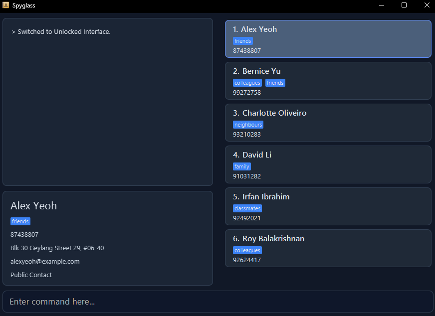

# Spyglass

* **Spyglass** is a privacy-focused desktop application for managing sensitive contact details, guaranteed for individuals living in **high-scrutiny domestic environments**.
* It is a specialized evolution of the AddressBook Level 3 (AB3) project, optimized for users who require **high-speed input** and **discretion** over their personal data.

### Key Features

* **Dual-State Security (Lock/Unlock):** Features a high-speed locking mechanism that instantly secures sensitive information, allowing the user to toggle between a private "Unlocked" state and a restricted "Locked" state.
* **Hidden Authentication:** Transitioning to the Unlocked state is handled via a hidden command that masquerades as an "unknown command" to casual observers, ensuring the existence of private data remains undetected.
* **Keyboard-Centric Design:** Engineered for power users who prefer the speed and efficiency of a **Command Line Interface (CLI)**.
* **Robust Data Management:** Supports adding, deleting, listing and advanced searching of contacts with strict validation to ensure data integrity and privacy.
* **Low-Profile Aesthetic:** Designed to blend into standard professional environments, providing a secure sanctuary for data without drawing unnecessary attention.

### Project Characteristics

* **Object-Oriented Design:** Written in a clean, extensible OOP fashion, providing a robust codebase for further development.
* **Performance-Oriented:** Approximately **6 KLoC**, offering a realistic project scale that is fast, lightweight, and reliable.
* **Comprehensive Documentation:** Comes with adapted User and Developer guides specifically tailored for the Spyglass privacy ecosystem.

* For detailed documentation, visit the **[Spyglass User Guide](https://ay2526s2-cs2103t-t15-2.github.io/tp/)**.

### Acknowledgements

This project is a part of the [se-education.org](https://se-education.org) initiative. It is based on the AddressBook-Level3 project created by the **SE-EDU initiative**.

* **Libraries used:** [JavaFX](https://openjfx.io/), [Jackson](https://github.com/FasterXML/jackson), [JUnit5](https://github.com/junit-team/junit5)
